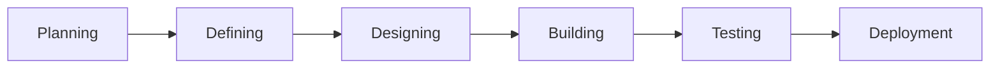

# CDP Batch 7 By Spring Rain

## Class 1
- HTML
- CSS
- Git

## Class 2
- JavaScript

## Class 3
- JavaScript
- Hoisted up of JS
- Array of JS
- - Push , Pop, Shift, Unshift 
- Deep copy and shallow copy
- Spread operator
- Slice and Splice
- Filter
- Doule equal and triple equal
- Reduce - sum of array
- foreach with array
- map with array
- DOM
- BOM
- - Window.location
- - Window.history
- - Window.navigator
- - Window.screen
-  browser local storage
-  browser session storage

## Class 4

- Callback
- Promise
- Async and Await
- Fetch API
- JSON
- Worker with JS

### Assignment
By clicking a button the worker will fetch data from jsonplaceholder and show the table data in the browser.
Use async and await , worker , callback.

## Class 5

- Folder structure
- GitHub Commit should be meaningful
- Git flow(Basically a framework for managing your branches)
- Clickup (Project management tool)
- Generative AI
- ZZZCODE.ai (Code generation tool)
- Github AUCorp(Github Account)
- Microservices vs Monolithic (Architecture)
- microservices.io ( A website for microservices)
- Serverless(Will be discussed in the next class)

## Class 6
### SDLC
The SDLC contains

Different types of SDLC
- Waterfall
- Agile
- Spiral

https://www.atlassian.com/agile
#### Agile
Client is always involved in the development process. It is a continuous process. It is a flexible process. It is a fast process. It is a cost-effective process.

Agile has four main point

- Individuals and interactions over processes and tools ( Discuss about what you did and what you are going to do and who is blocked for you)
- Working software over comprehensive documentation ( MVP first then add more features)
- Customer collaboration over contract negotiation
- Responding to change over following a plan

#### Sprint or Scrum
- Story point
- Overestimation

#### Kanban
- Always ready for new work

#### Iterative
- More like sprint
- Here work can be moved from one sprint to another sprint

### DevOps

It supports agile proces. It is a combination of development and operation.

- A CI/CD pipeline is maintained in DevOps.
- Integration works with sonarqube , unit test, code coverage, etc.

### Retrospective
Retrospective meeting disucss about what went wrong and what went right , what could be better . Retro meeting is done after every sprint.

### Six Sigma
- DMAIC (Define, Measure, Analyze, Improve, Control)
- DMADV (Define, Measure, Analyze, Design, Verify)

### Design Pattern

Refactoring Guru

- Creational
    - Factory Pattern
    - Singleton Pattern (Database connection)
- Structural
    - Adapter Pattern
- Behavioral
    - Chain of Responsibility

### DDD
#### An example of DDD
- Described an decomposed an real life application along with a discussion of why microservices are used.

- Circuit Breaker Pattern

### Pros and Cons of JS
- Functional Programming
- No strict type

